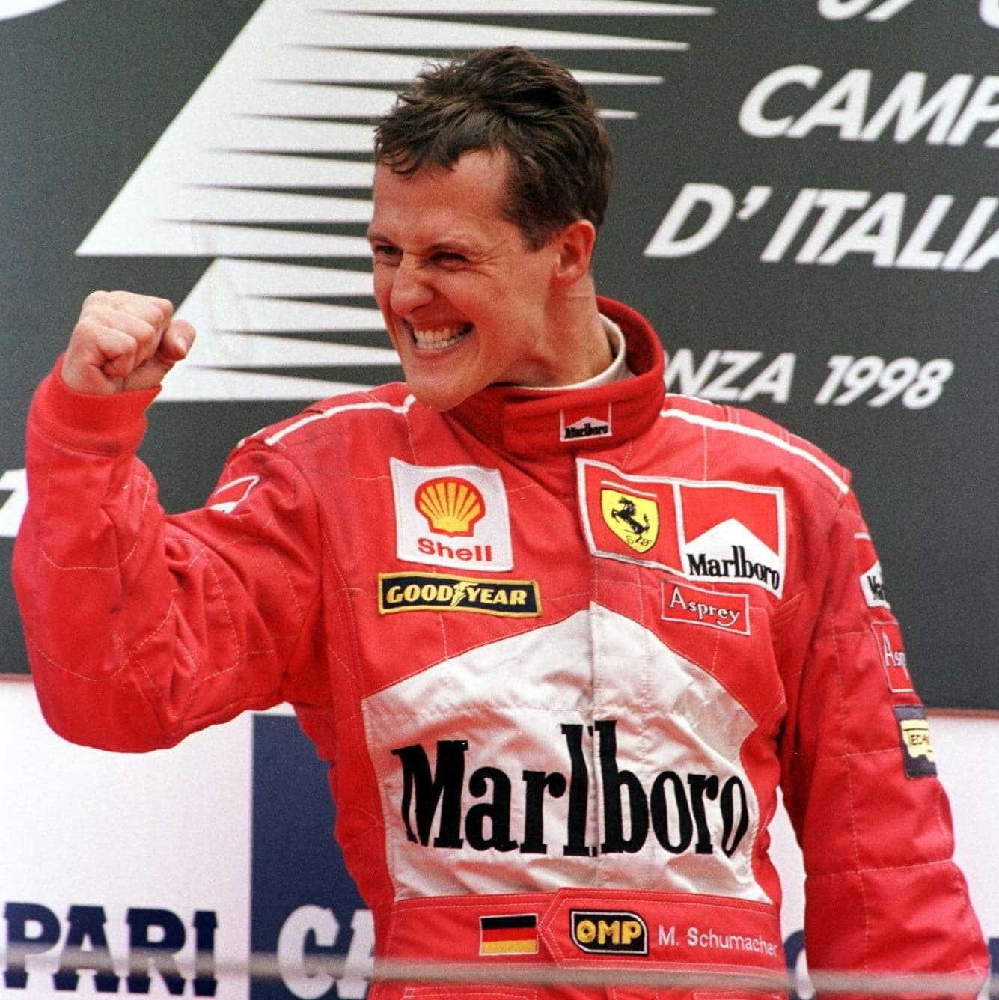
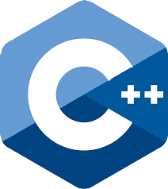
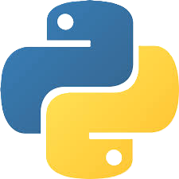
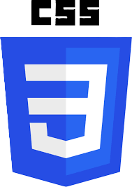
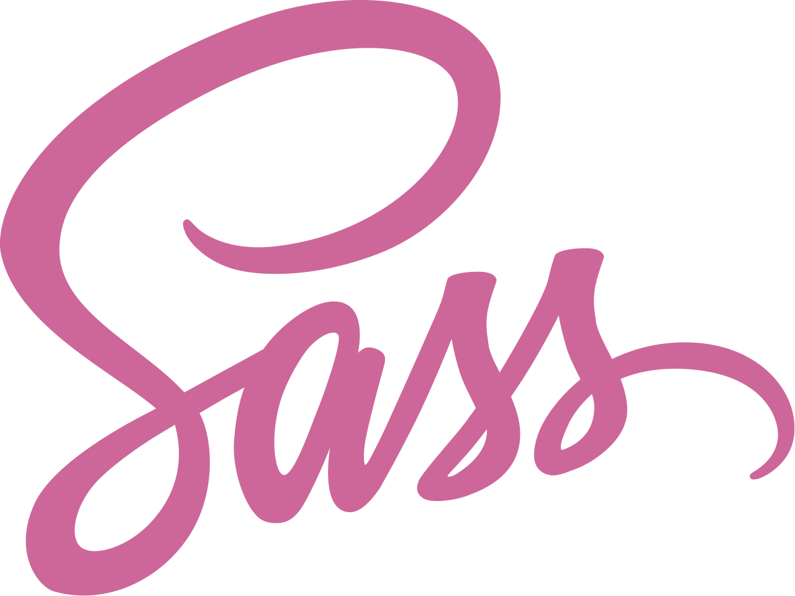
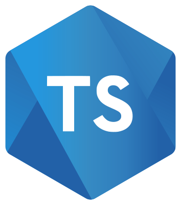
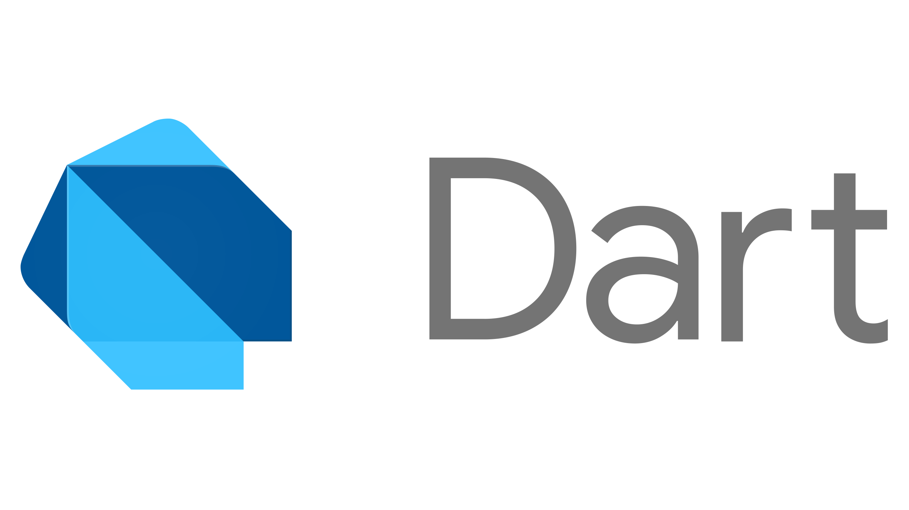
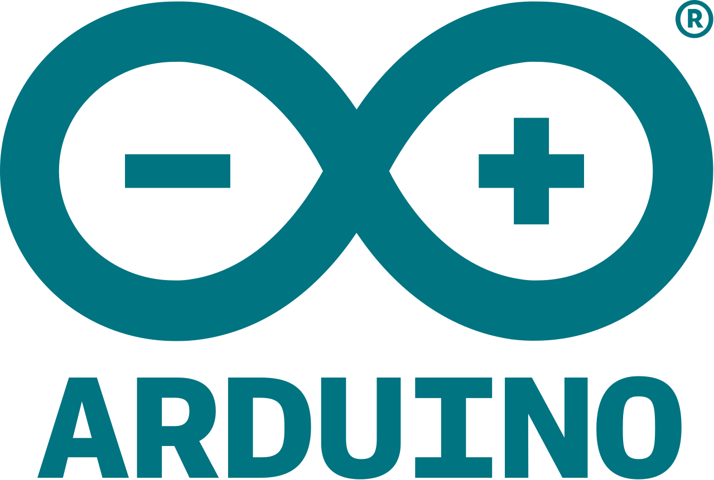

<h1 text align=center>Daniele Chiarion</h1>

  

  

| Github Statistics | Streaks | Languages |
|:-------------------:|:---------:|:-----------:|
|  |  |  |

<!---
danielechiarion/danielechiarion is a ✨ special ✨ repository because its `README.md` (this file) appears on your GitHub profile.
You can click the Preview link to take a look at your changes.
--->
  
<h2 align="center">Languages kwnown:</h2>

  
  
  
  
  
  
  
  
  
  
  

  
<h2 align="center">Working with:</h2>

  
  
  
  
  

